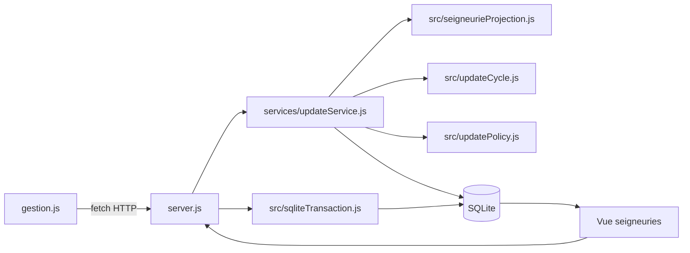
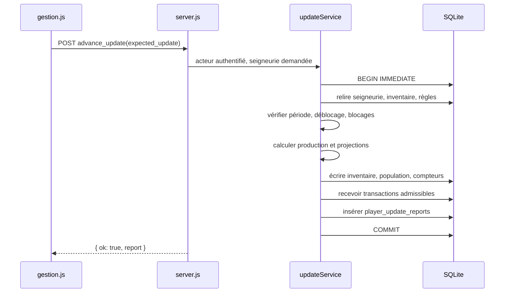
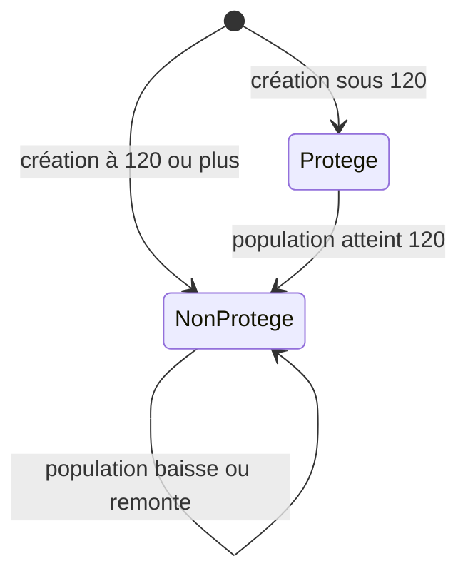

# Implémentation de Gestion : progression, protection et relevés

Ce document décrit le fonctionnement serveur des opérations de Gestion qui changent l’état d’une seigneurie : progression d’une mise à jour, construction, fixation de taxe et lecture du relevé associé. Toute donnée reçue du navigateur est une demande; le serveur relit l’état faisant autorité et valide l’action avant d’écrire.

## Architecture



`server.js` possède l’authentification, le routage, les migrations de schéma et les vues. `services/updateService.js` orchestre la progression et construit les relevés. `services/buildingStateService.js` valide l'activation et la destruction des bâtiments dans des transactions dédiées. `src/sqliteTransaction.js` ouvre une connexion dédiée, prend le verrou d’écriture SQLite avec `BEGIN IMMEDIATE`, puis garantit `COMMIT` ou `ROLLBACK` et fermeture. `src/seigneurieProjection.js` calcule production, consommation, capacités et emploi depuis des objets simples, sans accès à la base. `src/updateCycle.js` définit les périodes et dates d’ouverture; `src/updatePolicy.js` vérifie le gel et le plafond configurés par l’administration.

`gestion.js` affiche la période enregistrée, la prochaine période, les blocages serveur et un aperçu indicatif des variations. Cet aperçu ne promet pas l'état final : la famine, les capacités et les réceptions peuvent modifier le relevé réel. Après progression, la page présente les états avant/après et les événements consignés. `adminUpdateReports.js`, chargé par `admin.html`, permet de choisir un relevé via `GET /api/admin/update_reports` (administrateur seulement), puis de comparer les valeurs changées avec la feuille manuelle. Les écarts et incohérences arithmétiques sont signalés immédiatement. Les valeurs attendues sont conservées par relevé dans la page, sans enregistrement sur le serveur, et disparaissent au rechargement.

Les autres mutations de Gestion relisent désormais leurs prérequis dans une transaction `BEGIN IMMEDIATE` : `services/infrastructureActionService.js` pour détruire une infrastructure, affecter ses travailleurs ou déclencher sa production immédiate ; `services/spellCastService.js` pour débiter un sort, appliquer ses effets et augmenter le compteur. Le retour d'un échange refusé débite/crédite et marque l'échange comme retourné dans la même transaction. La décision d'accepter ou de refuser un échange ne peut être écrite qu'une fois. Ces changements sécurisent l'exécution des règles déjà codées ; ils ne tranchent pas les écarts de règles consignés dans `ANALYSE_FEUILLE_PERSONNAGE.md`.

En cas de sur-travail, les actions de bâtiment et d'infrastructure qui diminuent ou conservent l'emploi restent permises, même si une seule action ne suffit pas à résoudre la surcharge. Construire un élément sans travailleurs est donc possible si ses coûts ne l'aggravent pas. Une activation, une affectation ou une construction qui augmente la surcharge est refusée. La mise à jour de période demeure bloquée jusqu'à ce que l'emploi redevienne inférieur ou égal à la population. `src/employmentPolicy.js` partage cette règle entre les routes et les services.

Pour un sort, un jet de réussite manqué est un résultat de jeu valide : le coût est débité et le lancement est compté, mais l'effet n'est pas appliqué. Une erreur technique pendant les écritures annule l'ensemble de la transaction, afin d'éviter un débit sans résultat enregistré ou un effet partiel.



## Schéma persistant

### Relevés

La table `player_update_reports` garde un relevé durable par période atteinte. Son schéma est créé dans `server.js` :

```sql
CREATE TABLE IF NOT EXISTS player_update_reports (
  id INTEGER PRIMARY KEY AUTOINCREMENT,
  player_id INTEGER NOT NULL REFERENCES players(id),
  initiated_by_user_id INTEGER REFERENCES users(id),
  from_year INTEGER NOT NULL,
  from_number INTEGER NOT NULL CHECK (from_number BETWEEN 1 AND 10),
  to_year INTEGER NOT NULL,
  to_number INTEGER NOT NULL CHECK (to_number BETWEEN 1 AND 10),
  ruleset_version TEXT NOT NULL,
  before_json TEXT NOT NULL,
  delta_json TEXT NOT NULL,
  after_json TEXT NOT NULL,
  events_json TEXT NOT NULL DEFAULT '[]',
  created_at TEXT NOT NULL DEFAULT CURRENT_TIMESTAMP,
  UNIQUE (player_id, to_year, to_number)
);
CREATE INDEX IF NOT EXISTS idx_player_update_reports_player_created
  ON player_update_reports (player_id, created_at DESC, id DESC);
```

`before_json` et `after_json` contiennent la population, la période, l’inventaire connu et les compteurs de commerce/sorts. `delta_json` détaille les changements de population et d’inventaire, la production, les taxes, la consommation, les ressources reçues et les pertes par capacité. `events_json` contient les événements montrés au joueur, par exemple la famine ou une réception partielle. Le format d’inventaire est limité aux ressources listées par `inventaireFields`. La version de règles actuelle est `1026-1.0-initial`.

L’unicité `(player_id, to_year, to_number)` empêche d’insérer deux relevés pour la même période de la même seigneurie. La création du relevé et les changements de jeu ont lieu dans la même transaction : il n’existe pas de rapport confirmé si l’avancement a été annulé.

### Protection débutante

La colonne est ajoutée à `players` et exposée par la vue `seigneuries` :

```sql
beginner_protection INTEGER NOT NULL DEFAULT 1
  CHECK (beginner_protection IN (0, 1))
```

Les règles SQLite installées par `server.js` sont équivalentes aux déclencheurs suivants :

```sql
CREATE TRIGGER players_beginner_protection_insert
AFTER INSERT ON players
WHEN NEW.population >= 120 AND NEW.beginner_protection != 0
BEGIN
  UPDATE players SET beginner_protection=0 WHERE id=NEW.id;
END;

CREATE TRIGGER players_beginner_protection_threshold
AFTER UPDATE OF population ON players
WHEN NEW.population >= 120 AND NEW.beginner_protection != 0
BEGIN
  UPDATE players SET beginner_protection=0 WHERE id=NEW.id;
END;

CREATE TRIGGER players_beginner_protection_irreversible
BEFORE UPDATE OF beginner_protection ON players
WHEN OLD.beginner_protection=0 AND NEW.beginner_protection!=0
BEGIN
  SELECT RAISE(ABORT, 'La protection débutante ne peut pas être réactivée.');
END;
```

À la création, la protection vaut 1 par défaut et s’applique aux populations sous 120. Un joueur créé à 120 ou plus est immédiatement marqué non protégé. Au premier passage à 120, le déclencheur la retire; toute baisse ultérieure la laisse à 0. Pour une ancienne base à laquelle la colonne manque, la migration ajoute la colonne puis initialise les comptes préexistants à 0, car leur historique ne permet pas de savoir s’ils ont déjà franchi le seuil.



## Contrats HTTP

### Avancer la période

`POST /api/seigneurie/advance_update` exige une session authentifiée. Le corps contient :

```json
{
  "expected_update": { "year": 1026, "number": 3 },
  "seigneurie_id": 42
}
```

`expected_update` est obligatoire; `number` doit être compris entre 1 et 10. `seigneurie_id` est facultatif et n’est appliqué que si l’acteur est un administrateur actif. Un joueur ordinaire est toujours résolu depuis son compte en session.

Succès : `200 { "ok": true, "report": { "id", "from_update", "current_update", "current_update_label", "before", "delta", "after", "events", "ruleset_version" } }`.

Erreurs métier renvoyées sous la forme `{ "code": "…", "error": "…" }` :

| HTTP | Code | Cause |
| --- | --- | --- |
| 400 | `invalid_expected_update` | Période absente ou invalide. |
| 400 | `inventory_missing` | Inventaire introuvable. |
| 400 | `population_overload` | Emploi calculé supérieur à la population. |
| 400 | `date_locked` | La période suivante n’est pas encore ouverte selon le calendrier. |
| 403 | Code de la politique | Gel global ou plafond de progression. |
| 401 | `unauthorized` | Session absente ou acteur non valide. |
| 404 | `player_not_found` | Seigneurie associée introuvable. |
| 409 | `update_conflict` | L’état courant ne correspond plus à `expected_update`; le client doit recharger. |

Une erreur technique non munie d’un statut métier passe par le gestionnaire d’erreur serveur. Tout échec après `BEGIN IMMEDIATE` annule l’ensemble des écritures.

### Lire un relevé

`GET /api/seigneurie/update_reports/:id` exige une session. Le propriétaire peut lire son relevé; un administrateur actif peut lire tous les relevés. Pour un identifiant mal formé, absent ou non autorisé, la route renvoie `404 { "error": "Relevé introuvable" }`, ce qui ne révèle pas l’existence d’un relevé tiers. La réponse réussie contient `id`, `player_id`, `from_update`, `current_update`, `current_update_label`, `before`, `delta`, `after`, `events`, `created_at` et `ruleset_version`.

`GET /api/my_seigneurie` inclut `latest_update_report_id` afin que l’interface puisse proposer le relevé le plus récent. Cette route ne donne pas au client le droit de choisir un autre propriétaire.

### Fixer la taxe

`POST /api/tax_rate` reçoit `{ "tax_rate": 0..12 }` et, pour un administrateur actif, peut aussi recevoir `seigneurie_id`. Le serveur vérifie un entier de 0 à 12, relit la protection dans une transaction d’écriture, puis met à jour `seigneuries_info.tax_rate`. Un taux supérieur à 5 tant que `beginner_protection=1` est refusé en `400` avec une cause explicite. Une session absente produit `401`; une seigneurie absente produit `404`.

### Construire un bâtiment

`POST /api/building` reçoit `id`, `quantity` et éventuellement `props` ou `seigneurie_id` pour l’administrateur actif. La route valide les identifiants et la quantité, résout la seigneurie depuis la session, vérifie disponibilité, propriété, restrictions, prérequis, limites, ressources et emploi, puis consomme les ressources et écrit `players.buildings` sous `BEGIN IMMEDIATE`. Les refus métier sont renvoyés en `400`; une quantité ou un bâtiment invalide est aussi `400`; une session absente est `401`.

## Flux transactionnel de l’avancement

1. Valider le chemin de base, la date et le format de la période attendue avant le verrou.
2. Ouvrir une connexion SQLite dédiée et lancer `BEGIN IMMEDIATE` avec un délai d’attente de 5 secondes.
3. Résoudre le joueur depuis l’acteur. Seul un administrateur actif peut cibler explicitement une autre seigneurie.
4. Normaliser la position courante et la comparer à `expected_update`. Toute divergence renvoie `409` avant écriture.
5. Calculer la position suivante; relire inventaire, règles de bâtiments/infrastructures, propriétés de baronnie et politique d’avancement.
6. Calculer la projection économique partagée et refuser si l’emploi excède la population, si la date de déblocage n’est pas atteinte ou si la politique bloque la période.
7. Produire le snapshot initial; calculer les variations. La consommation alimentaire correspond à 15 vivres par habitant et 5 par esclave. Si le solde alimentaire devient négatif, l’implémentation actuelle calcule les morts comme `min(population, ceil(ceil(déficit / 15) / 2))`, puis ramène le stock à zéro. Les capacités plafonnent les stocks et l’excédent est consigné comme débordement.
8. Écrire l’inventaire, la population et la nouvelle période; remettre à zéro les compteurs terrestres, maritimes et de sorts.
9. Recevoir les échanges approuvés encore non reçus, quand leur période d’origine est atteinte. L’application respecte la capacité restante, journalise les ressources effectivement reçues et l’excédent; les lignes traitées sont marquées reçues.
10. Construire `after`, `delta` et `events`, insérer `player_update_reports`, puis valider par `COMMIT`.

L’ordre exact de production, famine, plafonds et réception est celui du code de `services/updateService.js`. Toute modification de cet ordre change les résultats et doit être accompagnée d’une mise à jour de cette documentation et de la version de règles du relevé.

## Fichiers concernés

| Fichier | Responsabilité |
| --- | --- |
| `server.js` | Schéma et migrations, vue `seigneuries`, déclencheurs de protection, authentification et routes HTTP. |
| `services/updateService.js` | Vérifications, résolution du propriétaire, calcul de progression, réception des échanges et création/lecture du relevé. |
| `src/sqliteTransaction.js` | Helpers SQL promisifiés et enveloppe `BEGIN IMMEDIATE` / `COMMIT` / `ROLLBACK`. |
| `src/seigneurieProjection.js` | Calcul pur commun de production, capacités, emploi, consommation et taxe. |
| `src/updateCycle.js` | Normalisation, libellés, successeur et date de déblocage des dix périodes. |
| `src/updatePolicy.js` | Gel global et limite inclusive configurés par l’administration. |
| `gestion.js` | Envoi de la période attendue, verrouillage du bouton, affichage de protection et de taxe, ouverture du relevé et rafraîchissement des données. |
| `gestion.html` et `styles.css` | Structure et présentation de la synthèse et du relevé. |
| `Documentation/GESTION_IMPLEMENTATION.md` | Contrat technique et règles de traitement décrits ici. |

## Erreurs, garanties et limites

- Une période périmée n’est jamais rejouée implicitement : `409` demande au navigateur de recharger l’état et de soumettre une nouvelle intention.
- Une erreur pendant une mise à jour ou une construction annule les débits et écritures effectués dans cette transaction.
- Le relevé décrit l’état réellement validé, y compris les réceptions et les pertes reportées par le service.
- La protection débutante est persistante et monotone. Une baisse de population ne rend pas de nouveau disponible le taux réduit.
- La version de règles est actuellement une constante de code (`1026-1.0-initial`); le système ne conserve pas encore une copie complète de chaque définition de règle avec le rapport.
- Les JSON du relevé sont des snapshots applicatifs; leur contenu n’est pas normalisé en tables de détail et dépend des ressources connues lors de la création.
- Le calcul actuel de famine et l’ordre des actions doivent être vérifiés contre le règlement applicable. Le relevé rend le résultat traçable, mais ne certifie pas à lui seul la conformité complète aux règles du jeu.
- Les routes de construction, d'activation et de destruction de bâtiment, les actions d'infrastructure, le lancement de sort et le retour d'un échange refusé sont transactionnels. Cette garantie ne s'étend pas automatiquement aux autres actions de Gestion.
- Les futurs effets agressifs entre joueurs doivent vérifier `beginner_protection` dans leur propre validation serveur et dans la même transaction que l’action.

## Contrôles fonctionnels à maintenir

La validation doit couvrir période périmée et concurrente, date verrouillée, gel et plafond, population employée excessive, famine, débordement de capacité, réception complète ou partielle, remise à zéro des compteurs, relevé après succès, autorisations propriétaire/administrateur, migration d’une base ancienne, irréversibilité de la protection, taux de taxe à 5 et au-dessus, et annulation complète lors d’un refus de construction ou d’une erreur d’écriture.
